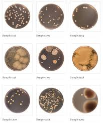

# Challenge - Belly-button-challenge
### Student Paola Moreno

## BuildMetadata function:

This function is responsible for constructing the metadata panel based on the selected sample.
It retrieves metadata from a provided URL, filtering it for the selected sample.
The metadata is then displayed in the HTML element with the id sample-metadata, with existing metadata being cleared before appending new tags for each key-value pair.

## BuildCharts function:

This function builds both the bubble and bar charts for the selected sample.
It fetches sample data from the provided URL, filtering it for the selected sample.
Extracted data includes otu_ids, otu_labels, and sample_values, which are used to construct the Bubble Chart and Bar Chart with appropriate settings.
The Bubble Chart plots OTU ID against Sample Values, while the Bar Chart displays the top 10 OTUs.

## Init function:

This function initializes the dashboard when the page loads.
It fetches sample names from the provided URL, populating the dropdown menu with these names.
The first sample from the list is selected, and both the charts and metadata panel are built using this sample.

## OptionChanged function:

This function is invoked whenever a new sample is selected from the dropdown menu.
It triggers the building of charts and the metadata panel for the newly selected sample.

## Initialization:
The dashboard is initialized by calling the init function at the end of the script, ensuring that the initial state of the dashboard is set up when the page loads.

## References:
Hulcr, J. et al. (2012) A Jungle in There: Bacteria in Belly Buttons are Highly Diverse, but Predictable. Retrieved from: http://robdunnlab.com/projects/belly-button-biodiversity/results-and-data/Links to an external site.

## Contributing

The development of these scripts involved contributions from various sources:

*Class Materials: The scripts were adapted from class materials for development purposes.

*Tutoring Session with Reza Abasaltian: Assistance and guidance were provided during a tutoring session with Reza Abasaltian.
